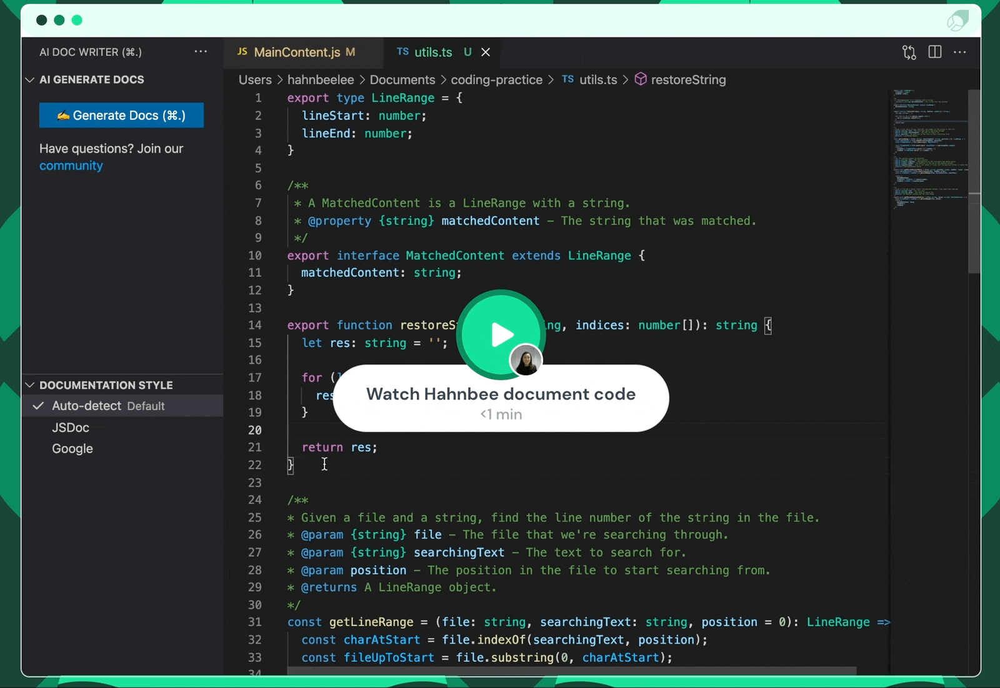

## Notice: Mintify Writer is no longer being updated by the Mintlify Team. Get started with our customer documentation product [here](https://mintlify.com).

# ✍️ Mintlify Writer

   

Writing documentation sucks. Let Mintlify take care of it. Just highlight code and see the magic.

### 👩‍💻 How to generate documentation

**Step 1** Highlight code or place cursor on the line you want to document
**Step 2** Click on the `Write Docs` button (or hit ⌘ + .)

### 📝 Languages supported

- Python
- JavaScript
- TypeScript
- JSX and TSX files
- C and C++
- PHP
- Java
- C#
- Ruby
- Rust
- Dart
- Go
- 🚧 More under construction

### 📑 Docstring formats supported

- JSDoc
- reST
- NumPy
- DocBlock
- Doxygen
- Javadoc
- GoDoc
- XML
- Google
- 🚧 More under construction

### 🚨 Disclaimer

We never store your code, but your code does leave your machine.

---

### More information

[Website](https://mintlify.com/)
[Twitter](https://twitter.com/mintlify)

_Built with 💚 by the Mintlify team_
